# University Web Platform

A platform designed to enhance university services for students, professors, and the administration.

## Overview

This project is a university web platform aimed at modernizing the educational experience by providing several key services:
- **Document Sharing:** Allowing students to share and access academic resources.
- **Announcement System:** Enabling professors and administrators to post important updates.
- **Letter Request Service:** Streamlining the process for students to request recommendation letters.
- **Blogging Space:** Facilitating a community where both students and professors can share articles and insights.

## Technologies

- **Frontend:** React.js, Material UI, Tailwind CSS
- **Backend:** Java (Spring Boot, Spring Security, Spring Data JPA)
- **Database:** PostgreSQL
- **Architecture:** Microservices
- **Additional Tools:** JWT for authentication, RabbitMQ for messaging, Eureka Server for service discovery, Sleuth Zipkin for monitoring

## Architecture & Engineering Decisions

The project utilizes a microservices architecture to ensure scalability, flexibility, and ease of maintenance. Key engineering decisions include:
- **Microservices:** Allowing independent development and deployment of each service.
- **Spring Boot:** Chosen for robust and scalable backend development.
- **React.js:** Used for a responsive and modular frontend.
- **Desktop App:** Electron.js for cross-platform desktop application
- **JWT:** Provides secure and portable authentication.
- **RabbitMQ:** Enables asynchronous communication between services.

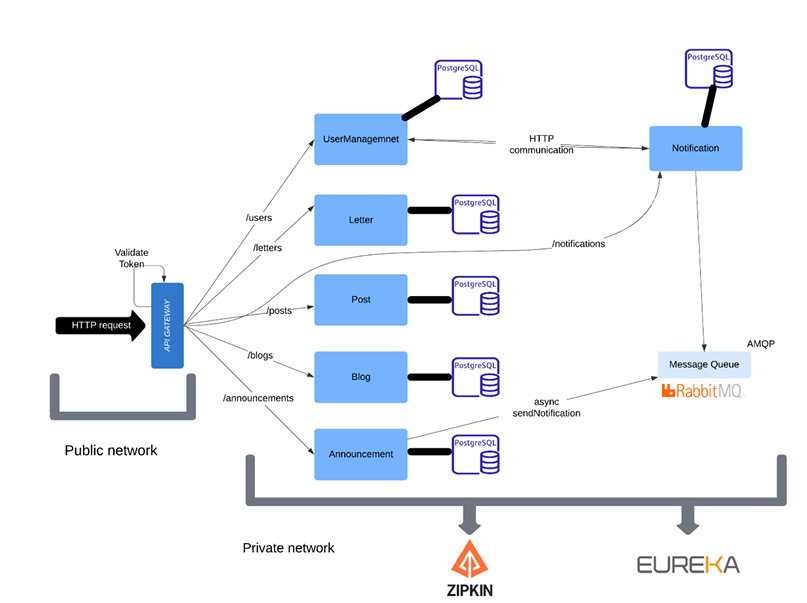


## 💻 Desktop Application (Built with Electron)
In addition to the web platform, we developed a **desktop application** using **Electron.js** to allow easier access to university services directly from a standalone application.

### Features:
- Cross-platform compatibility (Windows, macOS, Linux)
- Integrated authentication using JWT
- Access to document sharing, announcements, and letter requests
- Electron IPC for efficient data exchange with backend services

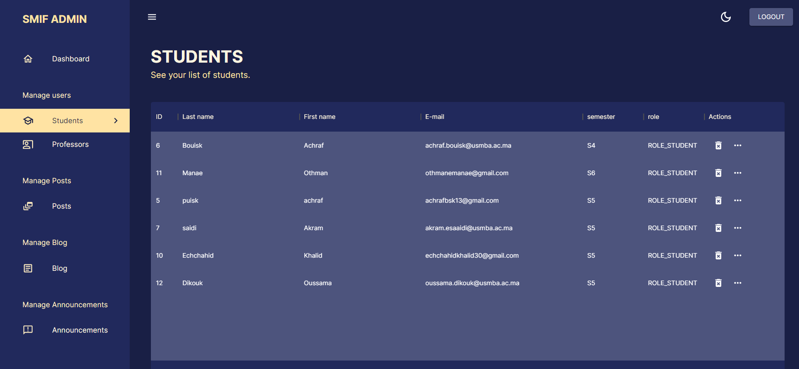

## Features

### 1. Authentication & Authorization
- Secure user login using JSON Web Tokens (JWT)
- Role-based access control (Student, Professor, Admin)

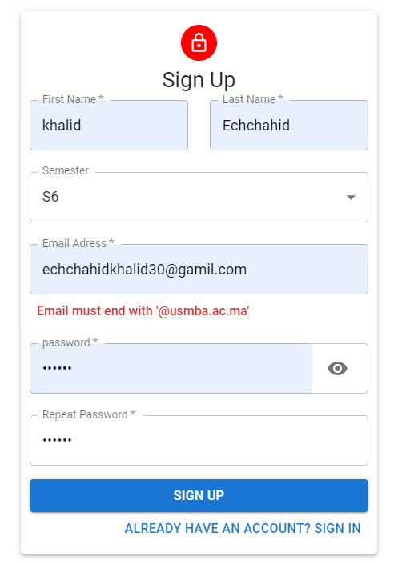
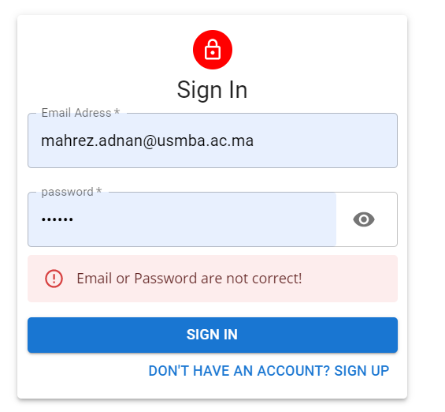


### 2. Document Sharing
- Upload, download, and manage academic documents
- Comment, like, and interact with shared documents

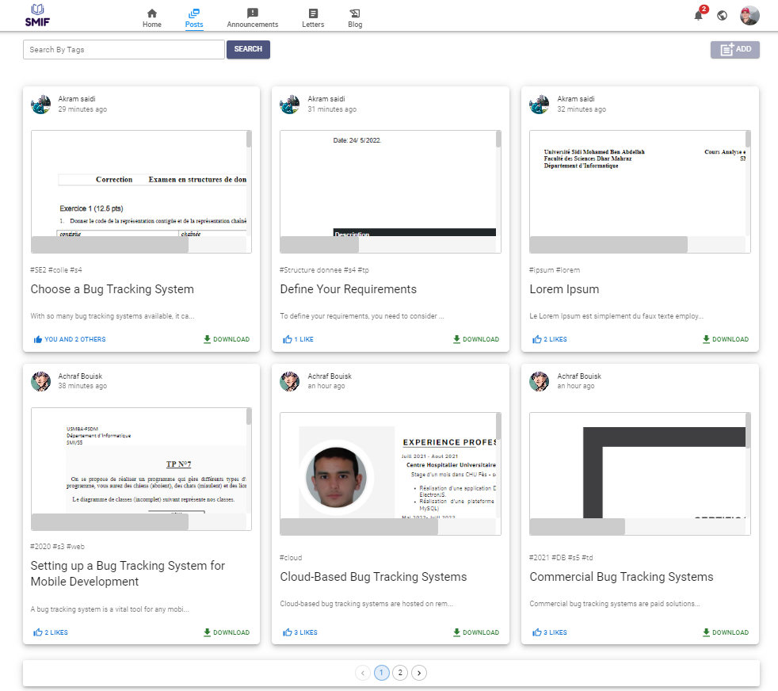
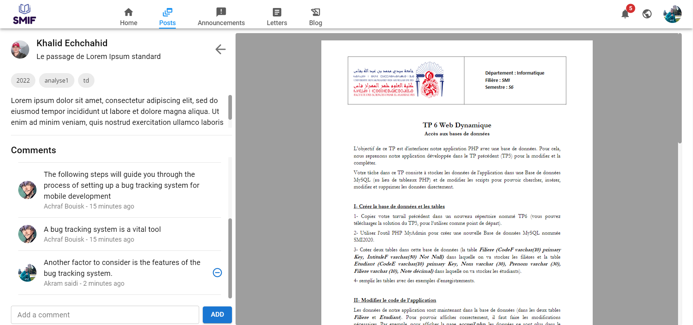

### 3. Announcement and Notification System
- Professors and administrators can post announcements and notifications
- Real-time updates ensure students are always informed

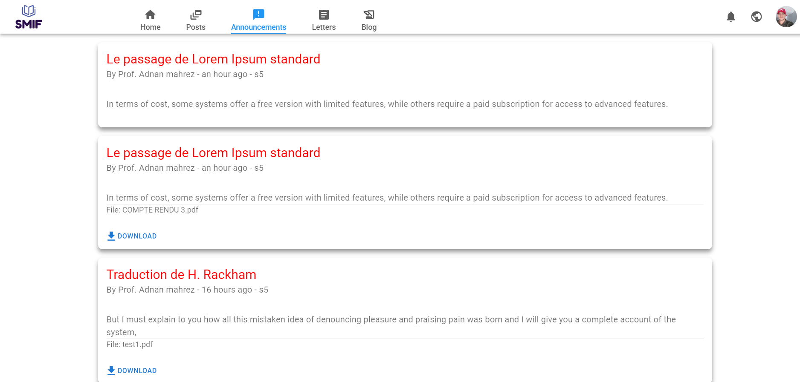
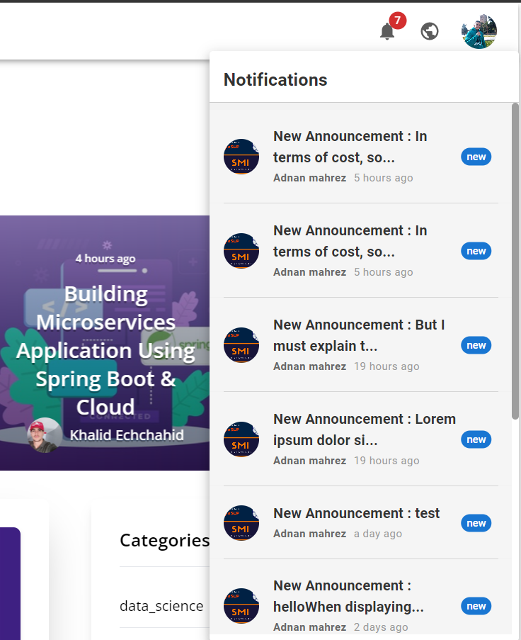

### 4. Letter Request Service
- Students can request recommendation letters online
- Professors can review, approve, and digitally send letters

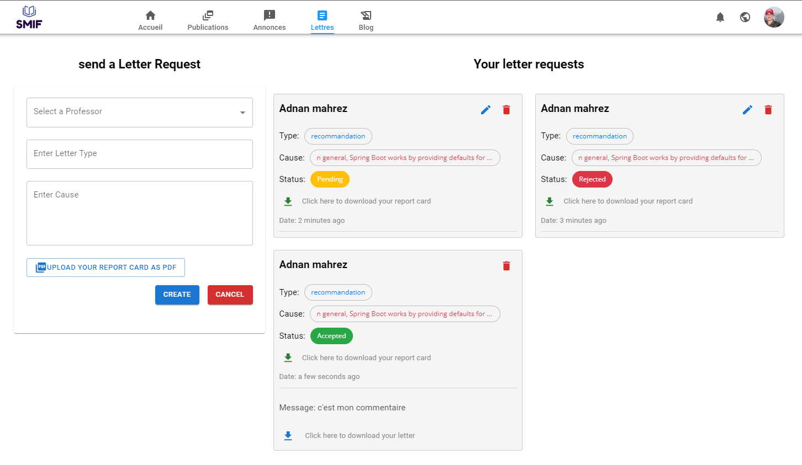

### 5. Blogging Space
- Create and share articles with a vibrant community
- Supports multimedia content such as images and videos

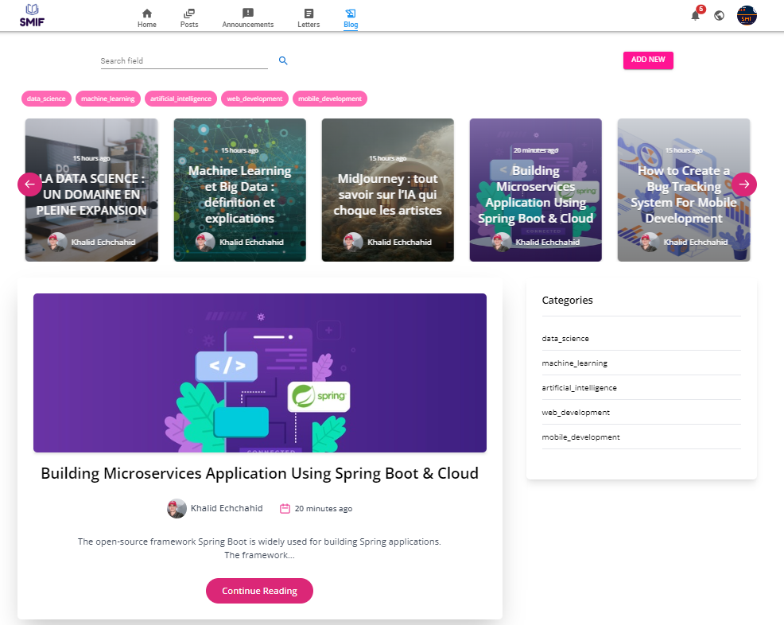
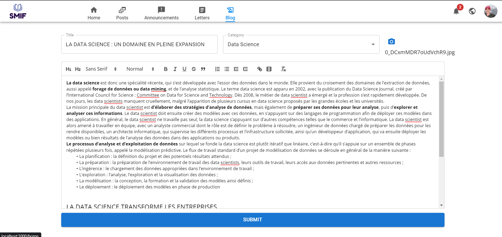

### 5. Profile Page

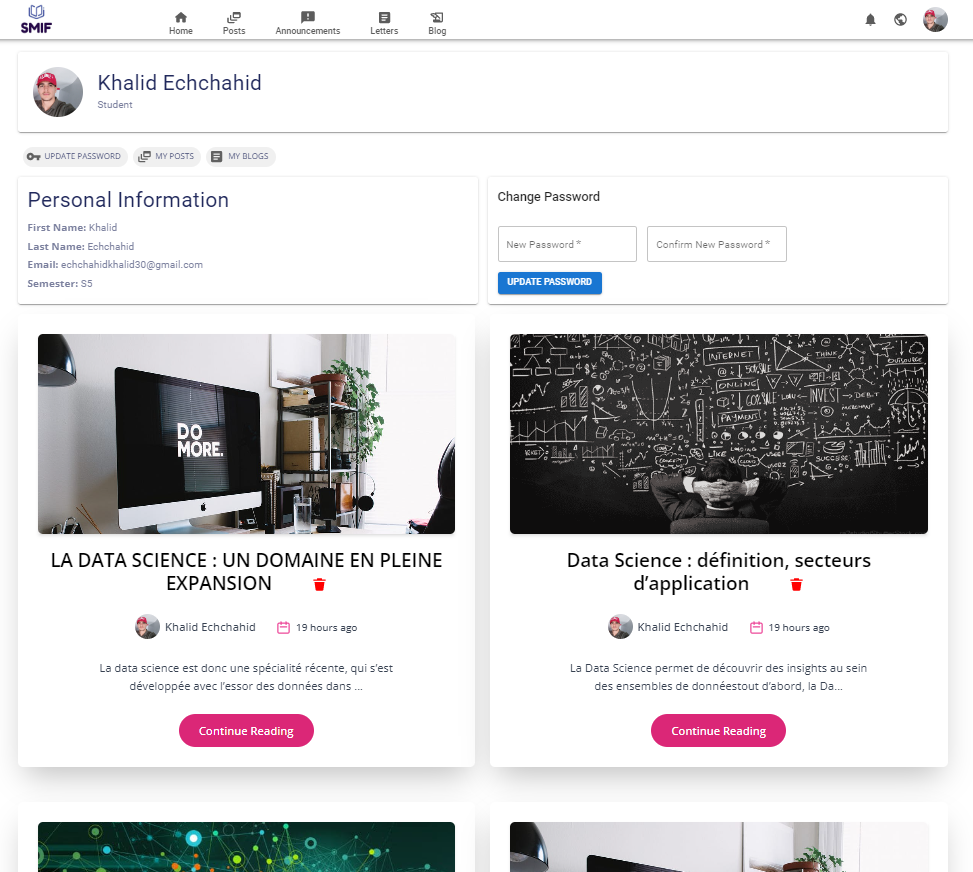

For more screenshots, please check the [`screen_pfe/`](screen_pfe/) folder in this repository.

## 🚀 Installation & Setup  

Follow these steps to set up the project locally.  

### **1️⃣ Clone the Repository**  
First, clone the repository to your local machine:  
```bash
git clone https://github.com/khalidEchchahid/full-project.git
```
## 📂 Project Structure  

This repository contains three main folders:  

- **`backend/`** → Contains the Spring Boot backend  
- **`frontend/`** → Contains the React.js frontend for the web application  
- **`desktop-app/`** → Contains the Electron.js desktop application  

After cloning, navigate into each folder separately to set up and run the corresponding service.  

### 🔧 Setup Instructions  

#### **For the Backend:**  
```bash
cd smiServices
mvn spring-boot:run 
```
#### **For the Frontend (Web App):**  
```bash
cd ../client
npm install
npm run dev
```
#### **For the Desktop App:**  
```bash
cd ../admin/client
npm install
npm start
```
Make sure each service is running correctly before testing the complete system. 🚀

